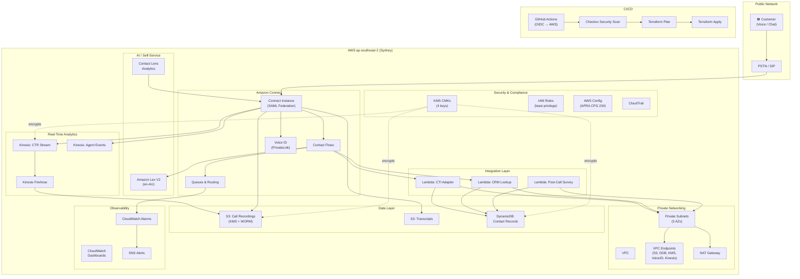
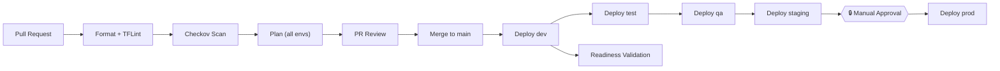

# Westpac CCaaS Terraform Blueprint

Infrastructure-as-Code for Westpac's Contact Center as a Service (CCaaS) platform, built on **AWS Amazon Connect**.

## High-Level Design



## Architecture

This blueprint provisions a complete contact center stack:

- **Amazon Connect** — Core CCaaS instance with SAML federation, contact flows, queues, and routing profiles
- **Amazon Lex V2** — IVR self-service bots (en-AU locale) for balance checks, lost cards, branch hours
- **Kinesis Data Streams** — Real-time CTR and agent event streaming with Firehose delivery to S3
- **AWS Lambda** — Integration functions (CTI adapter, CRM lookup, post-call survey) deployed in VPC
- **S3** — Call recordings and transcript storage with KMS encryption and WORM retention
- **DynamoDB** — Contact records and session data with point-in-time recovery
- **CloudWatch** — Dashboards, alarms (queue wait time, Lambda errors, DynamoDB throttling)
- **VPC** — Private networking with VPC endpoints for S3, DynamoDB, KMS, Voice ID, and Kinesis
- **AWS Config** — APRA CPG 234 conformance rules and account-level S3 public access block

## Compliance — APRA CPS 234

| Control | Implementation |
|---------|---------------|
| Data sovereignty | All resources in `ap-southeast-2` (Sydney), region-locked via IAM conditions |
| Encryption at rest | Customer-managed KMS keys for S3, DynamoDB, Kinesis, CloudWatch Logs |
| Encryption in transit | TLS 1.2+ enforced via S3 bucket policies, VPC endpoints |
| Access control | Least-privilege IAM, SAML federation, no long-lived credentials |
| Audit trail | CloudTrail (management events), VPC Flow Logs, Config rules |
| Monitoring | CloudWatch alarms with SNS alerting, Config compliance dashboard |
| Network isolation | Private subnets, VPC PrivateLink for AWS services including Voice ID |

## Environments

| Environment | VPC CIDR | Purpose | Auto-deploy | Approval |
|------------|----------|---------|-------------|----------|
| `dev` | `10.1.0.0/16` | Development & experimentation | Yes | None |
| `test` | `10.4.0.0/16` | Integration testing | Yes (after dev) | None |
| `qa` | `10.5.0.0/16` | Quality assurance | Yes (after test) | None |
| `staging` | `10.2.0.0/16` | Pre-production validation | Yes (after qa) | None |
| `prod` | `10.3.0.0/16` | Production | After staging | **Manual approval** |

## Repository Structure

```
environments/           Per-environment root modules (dev, test, qa, staging, prod)
modules/
  connect/              Amazon Connect instance, contact flows, Kinesis streaming
  routing/              Queues, routing profiles, hours of operation
  lambda/               Integration Lambda functions (CTI, CRM, survey)
  storage/              S3 buckets & DynamoDB tables
  security/             KMS keys & IAM roles/policies
  security_guardrails/  AWS Config rules, CloudTrail, S3 account-level blocks
  monitoring/           CloudWatch dashboards & alarms, SNS
  networking/           VPC, private subnets, NAT, VPC endpoints (incl. Voice ID)
  lex/                  Lex V2 bots & intents (en-AU)
backends/               S3 backend configs per environment
contact_flows/          Contact flow JSON definitions
scripts/                Bootstrap, validation, and helper scripts
.github/workflows/      CI/CD pipeline (OIDC + Checkov + manual prod gate)
```

## Prerequisites

- Terraform >= 1.7.0
- AWS CLI v2 configured with appropriate credentials
- Python 3.12+ with boto3 (for validation scripts)
- Pre-commit (`pip install pre-commit && pre-commit install`)
- TFLint (`brew install tflint` or equivalent)
- GitHub CLI (`gh`) for repository management

## Quick Start

### 1. Bootstrap Remote State (one-time)

```bash
chmod +x scripts/bootstrap-backend.sh
./scripts/bootstrap-backend.sh dev
```

### 2. Deploy an Environment

```bash
cd environments/dev
terraform init -backend-config=../../backends/dev.s3.tfbackend
terraform plan -out=tfplan
terraform apply tfplan
```

### 3. Validate Deployment

```bash
# Verify Connect instance
aws connect list-instances --region ap-southeast-2 \
  --query "InstanceSummaryList[?InstanceAlias=='westpac-ccaas-dev']"

# Run full readiness validation
python scripts/validate_readiness.py --environment dev
```

### 4. Deploy to Production

Production deploys flow through the CI/CD pipeline: `dev → test → qa → staging → prod` with manual approval required before prod apply. See `.github/workflows/deploy.yml`.

## CI/CD Pipeline



- **Authentication**: OIDC federation to AWS (no long-lived keys)
- **Security scanning**: Checkov runs on every PR
- **Plan visibility**: Terraform plan posted as PR comment per environment
- **Promotion**: Sequential deploy through environments
- **Production gate**: GitHub environment protection rules require manual approval

## Tagging Strategy

All resources are tagged with:

| Tag | Example |
|-----|---------|
| `Project` | `westpac-ccaas` |
| `Environment` | `dev` / `test` / `qa` / `staging` / `prod` |
| `Owner` | `platform-engineering` |
| `CostCenter` | `cc-contact-center` |
| `DataClassification` | `confidential` |
| `ManagedBy` | `terraform` |

Enforced via AWS Config `required-tags` rule in the `security_guardrails` module and `default_tags` in the AWS provider.

## Git Identity (Placeholder)

> **NOTE**: This repo was initialized with a placeholder git identity. Update before pushing to a shared remote:
> ```bash
> git config user.name "Your Real Name"
> git config user.email "your.real@email.com"
> ```
> Current placeholder: `Vikrant Rathore <vikrant.rathore@westpac.com.au>`
