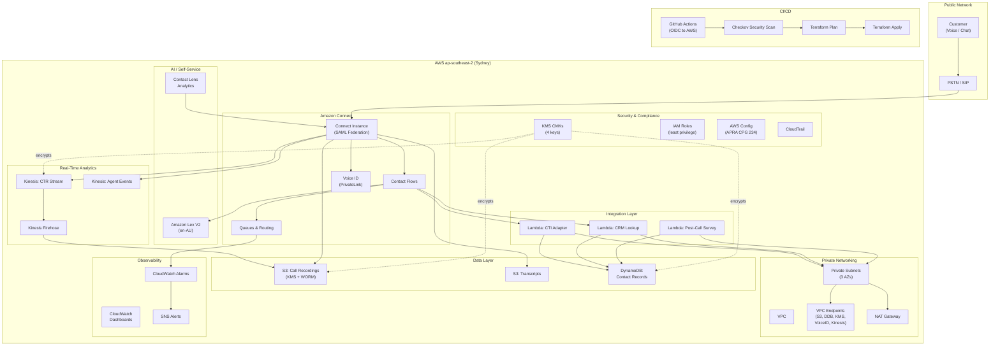
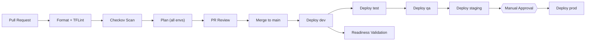

# Technical Design Document -- Westpac CCaaS Platform

| Field             | Value                                              |
|-------------------|----------------------------------------------------|
| **Document ID**   | WBC-CCAAS-TDD-001                                  |
| **Version**       | 1.0                                                |
| **Date**          | 2026-03-20                                         |
| **Classification**| CONFIDENTIAL                                       |
| **Owner**         | Platform Engineering                               |
| **Status**        | APPROVED                                           |

---

## Table of Contents

1. [Executive Summary](#1-executive-summary)
2. [Architecture Overview](#2-architecture-overview)
3. [Module Specifications](#3-module-specifications)
4. [Security Architecture](#4-security-architecture)
5. [Data Architecture](#5-data-architecture)
6. [Contact Center Design](#6-contact-center-design)
7. [Integration Layer (Lambda)](#7-integration-layer-lambda)
8. [Observability](#8-observability)
9. [Environment Strategy](#9-environment-strategy)
10. [CI/CD Pipeline](#10-cicd-pipeline)
11. [Operational Readiness](#11-operational-readiness)
12. [Naming and Tagging Conventions](#12-naming-and-tagging-conventions)

---

## 1. Executive Summary

This document describes the technical design of Westpac Group's Contact Center as a Service (CCaaS) platform. The platform is built on **AWS Amazon Connect** and deployed exclusively into the **ap-southeast-2 (Sydney)** AWS region via Terraform Infrastructure-as-Code (IaC).

The solution provides:

- An enterprise-grade, omni-channel contact center supporting voice and chat interactions.
- IVR self-service capabilities powered by Amazon Lex V2 with Australian English (en_AU) locale.
- Real-time contact trace record (CTR) and agent event streaming via Kinesis Data Streams and Firehose.
- Integration functions (Lambda) for CTI adapter, CRM lookup, and post-call surveys, all VPC-deployed.
- Full encryption at rest using four customer-managed KMS CMKs (connect, storage, DynamoDB, logs).
- Network isolation through a purpose-built VPC with private subnets and seven VPC endpoints.
- Continuous compliance with **APRA CPS 234** (Information Security) through AWS Config rules, CloudTrail, VPC Flow Logs, and mandatory tagging enforcement.

All infrastructure is codified in Terraform (>= 1.7.0), version-controlled in Git, and deployed through a GitHub Actions CI/CD pipeline with OIDC-based AWS authentication and sequential environment promotion (dev -> test -> qa -> staging -> prod with manual production approval).

---

## 2. Architecture Overview

### 2.1 High-Level Architecture



### 2.2 Module Dependency Graph

The platform is decomposed into nine Terraform modules, composed in a strict dependency order within each environment root module (`environments/<env>/main.tf`).

```
Phase 1: security
Phase 2: networking
Phase 3: storage
Phase 4: lambda          (depends on: networking, security, storage, connect)
Phase 5: lex             (depends on: security)
Phase 6: connect         (depends on: storage, security, lambda, lex)
Phase 7: routing         (depends on: connect)
Phase 8: monitoring      (depends on: connect, lambda, storage, security)

Independent: security_guardrails
```

**Inter-Module Data Flow:**

| Source Module         | Output                                                        | Consuming Module(s)                |
|-----------------------|---------------------------------------------------------------|------------------------------------|
| `security`            | `connect_kms_key_arn`, `storage_kms_key_arn`, `dynamodb_kms_key_arn`, `logs_kms_key_arn` | All modules requiring encryption   |
| `security`            | `connect_service_role_arn`, `lambda_execution_role_arn`, `lex_service_role_arn` | connect, lambda, lex               |
| `networking`          | `private_subnet_ids`, `lambda_security_group_id`              | lambda                             |
| `storage`             | `recordings_bucket_arn`, `recordings_bucket_id`, `transcripts_bucket_id`, `exports_bucket_arn` | connect, security                  |
| `storage`             | `contact_records_table_arn`, `contact_records_table_name`, `session_data_table_arn`, `session_data_table_name` | lambda, security, monitoring       |
| `lambda`              | `cti_adapter_function_arn`, `crm_lookup_function_arn`, `post_call_survey_function_arn` | connect (Lambda associations)      |
| `lambda`              | `cti_adapter_function_name`, `crm_lookup_function_name`, `post_call_survey_function_name` | monitoring (alarms & dashboards)   |
| `lex`                 | `bot_alias_arn`, `bot_id`                                     | connect (bot association)          |
| `connect`             | `instance_id`, `contact_flow_ids`                             | routing, monitoring                |
| `routing`             | `queue_ids`, `queue_arns`                                     | monitoring                         |

### 2.3 AWS Services Used

| AWS Service                     | Purpose                                                        | Managing Module         |
|---------------------------------|----------------------------------------------------------------|-------------------------|
| Amazon Connect                  | Core CCaaS instance, contact flows, phone numbers              | `connect`               |
| Amazon Lex V2                   | IVR self-service bot (en_AU locale)                            | `lex`                   |
| Amazon Kinesis Data Streams     | Real-time CTR and agent event streaming                        | `connect` (kinesis.tf)  |
| Amazon Kinesis Firehose         | CTR stream delivery to S3                                      | `connect` (kinesis.tf)  |
| AWS Lambda                      | Integration functions (CTI, CRM, survey)                       | `lambda`                |
| Amazon S3                       | Call recordings, transcripts, exports, access logs             | `storage`               |
| Amazon DynamoDB                 | Contact records and session state                              | `storage`               |
| AWS KMS                         | Customer-managed encryption keys (4 CMKs)                      | `security`              |
| AWS IAM                         | Service roles, per-function Lambda roles                       | `security`, `lambda`    |
| Amazon VPC                      | Network isolation, private/public subnets                      | `networking`            |
| VPC Endpoints (Gateway)         | Private access to S3 and DynamoDB                              | `networking`            |
| VPC Endpoints (Interface)       | Private access to KMS, Logs, STS, Voice ID, Kinesis            | `networking`            |
| NAT Gateway                     | Outbound internet for Lambda (CRM API calls)                   | `networking`            |
| Amazon CloudWatch               | Dashboards, metric alarms, log groups                          | `monitoring`, `networking`, `lambda`, `lex` |
| Amazon SNS                      | Alert routing (warning + critical topics)                      | `monitoring`            |
| Amazon SQS                      | Dead letter queues for Lambda functions                        | `lambda`                |
| AWS Config                      | Compliance rules (16 managed rules)                            | `security_guardrails`   |
| AWS CloudTrail                  | API audit logging (multi-region, KMS encrypted)                | `security_guardrails`   |
| VPC Flow Logs                   | Network traffic audit logging                                  | `networking`            |
| AWS X-Ray                       | Lambda distributed tracing                                     | `lambda`                |

---

## 3. Module Specifications

### 3.1 Module: `security`

**Purpose:** Provision customer-managed KMS encryption keys and service-level IAM roles that are consumed by all downstream modules.

**Key Resources Created:**

| Terraform Resource Type             | Instance(s)                                               |
|-------------------------------------|-----------------------------------------------------------|
| `aws_kms_key`                       | `connect_key`, `storage_key`, `dynamodb_key`, `logs_key`  |
| `aws_kms_alias`                     | One alias per key (`alias/westpac-ccaas-{env}-{purpose}`) |
| `aws_iam_role`                      | `connect_service_role`, `lambda_execution_role`, `lex_service_role` |
| `aws_iam_role_policy_attachment`    | Lambda VPC access managed policy                          |
| `data.aws_iam_policy_document`      | KMS key policy, assume role policies (connect, lambda, lex) |

**Key Input Variables:**

- `environment` -- Deployment environment name
- `project_name` -- Project identifier for resource naming
- `aws_region` -- Target AWS region (ap-southeast-2)
- `kms_deletion_window_days` -- KMS key deletion waiting period (default: 7)
- `dynamodb_table_arns` -- ARNs of DynamoDB tables (for IAM scoping)
- `s3_bucket_arns` -- ARNs of S3 buckets (for IAM scoping)

**Outputs Consumed by Other Modules:**

- `connect_kms_key_arn` -- Used by lambda (environment variable encryption) and connect (instance encryption)
- `storage_kms_key_arn` -- Used by storage (S3 SSE), connect (storage config encryption, Kinesis encryption)
- `dynamodb_kms_key_arn` -- Used by storage (DynamoDB SSE)
- `logs_kms_key_arn` -- Used by networking (VPC Flow Logs), lambda (log groups), lex (conversation logs), monitoring (SNS topics)
- `connect_service_role_arn` -- Used by connect module
- `lex_service_role_arn` -- Used by lex module

**Security Controls:**

- KMS key rotation enabled on all four CMKs
- Key policy restricts administration to the account root principal
- Confused deputy protection via `aws:SourceAccount` condition on all assume role policies
- Separate key per data domain (connect, storage, DynamoDB, logs) for blast radius isolation

---

### 3.2 Module: `networking`

**Purpose:** Provide VPC infrastructure with private subnets for Lambda functions and VPC endpoints for private AWS API access, ensuring no workload has public internet exposure.

**Key Resources Created:**

| Terraform Resource Type                | Instance(s)                                                |
|----------------------------------------|------------------------------------------------------------|
| `aws_vpc`                              | Single VPC per environment                                 |
| `aws_subnet`                           | 3 private subnets + 3 public subnets (one per AZ)         |
| `aws_internet_gateway`                 | One IGW for NAT outbound path                              |
| `aws_eip`                              | Elastic IPs for NAT gateways (count configurable)          |
| `aws_nat_gateway`                      | NAT gateways (1 for dev, 3 for prod HA)                   |
| `aws_route_table`                      | 1 public + 3 private route tables                          |
| `aws_route`                            | Public internet route + private NAT routes                 |
| `aws_route_table_association`          | 6 associations (3 public + 3 private)                      |
| `aws_cloudwatch_log_group`             | VPC Flow Logs log group (365-day retention, KMS encrypted) |
| `aws_iam_role`                         | VPC Flow Logs delivery role                                |
| `aws_flow_log`                         | VPC Flow Log (ALL traffic, 60s aggregation)                |
| `aws_default_security_group`           | Default SG restricted (no rules, CKV2_AWS_12)             |
| `aws_security_group`                   | Lambda SG (egress-only) + VPC endpoint SG (HTTPS inbound) |
| `aws_vpc_security_group_egress_rule`   | Lambda all-outbound rule                                   |
| `aws_vpc_security_group_ingress_rule`  | VPC endpoint HTTPS from VPC CIDR                           |
| `aws_vpc_endpoint`                     | 2 Gateway (S3, DynamoDB) + 5 Interface (KMS, Logs, STS, Voice ID, Kinesis) |

**Key Input Variables:**

- `vpc_cidr` -- VPC CIDR block (environment-specific)
- `nat_gateway_count` -- Number of NAT gateways (1 for dev, 3 for prod)
- `logs_kms_key_arn` -- KMS key for VPC Flow Log encryption

**Outputs Consumed by Other Modules:**

- `private_subnet_ids` -- Used by lambda (VPC deployment)
- `lambda_security_group_id` -- Used by lambda (VPC config)

**Security Controls:**

- `map_public_ip_on_launch = false` on all subnets (including public)
- Default security group restricted with no ingress/egress rules
- VPC Flow Logs capture ALL traffic with 60-second aggregation
- Flow Logs encrypted at rest via KMS CMK
- Flow Logs retained for 365 days
- VPC endpoint SG restricted to HTTPS (port 443) from VPC CIDR only
- Lambda SG permits egress only, no inbound rules

---

### 3.3 Module: `storage`

**Purpose:** Provision S3 buckets for call recordings, transcripts, and exports, along with DynamoDB tables for contact records and session data.

**Key Resources Created:**

| Terraform Resource Type                              | Instance(s)                                        |
|------------------------------------------------------|----------------------------------------------------|
| `aws_s3_bucket`                                      | `recordings`, `transcripts`, `exports`, `access_logs` |
| `aws_s3_bucket_versioning`                           | Enabled on all 4 buckets                           |
| `aws_s3_bucket_server_side_encryption_configuration` | KMS SSE on recordings/transcripts/exports; AES256 on access_logs |
| `aws_s3_bucket_public_access_block`                  | All 4 buckets fully blocked                        |
| `aws_s3_bucket_policy`                               | SSL-only enforcement on recordings/transcripts/exports |
| `aws_s3_bucket_lifecycle_configuration`              | Glacier transition + retention on recordings/transcripts; expiration on exports/access_logs |
| `aws_s3_bucket_logging`                              | Access logging to access_logs bucket for recordings/transcripts/exports |
| `aws_dynamodb_table`                                 | `contact_records` (contactId/timestamp), `session_data` (sessionId) |

**Key Input Variables:**

- `storage_kms_key_arn` -- KMS key for S3 encryption
- `dynamodb_kms_key_arn` -- KMS key for DynamoDB encryption
- `dynamodb_billing_mode` -- PAY_PER_REQUEST or PROVISIONED
- `recording_glacier_days` -- Days before Glacier transition (default: 90)
- `recording_retention_days` -- Days before expiration (default: 30 in dev)

**Outputs Consumed by Other Modules:**

- `recordings_bucket_arn`, `recordings_bucket_id` -- connect (storage config), security (IAM scoping)
- `transcripts_bucket_id` -- connect (storage config)
- `exports_bucket_arn` -- security (IAM scoping)
- `contact_records_table_arn`, `contact_records_table_name` -- lambda, security, monitoring
- `session_data_table_arn`, `session_data_table_name` -- lambda, security, monitoring

**Security Controls:**

- KMS CMK encryption (SSE-KMS) with bucket key enabled on all data buckets
- Bucket policies deny all non-SSL (non-TLS) requests
- Public access block (all four flags) on every bucket
- Versioning enabled on all buckets
- S3 access logging to dedicated access_logs bucket
- DynamoDB server-side encryption with KMS CMK
- DynamoDB point-in-time recovery (PITR) enabled
- DynamoDB TTL enabled on `expiry` attribute

---

### 3.4 Module: `lambda`

**Purpose:** Deploy integration Lambda functions with per-function IAM roles, VPC placement, DLQ, X-Ray tracing, and code signing support.

**Key Resources Created:**

| Terraform Resource Type              | Instance(s)                                         |
|--------------------------------------|-----------------------------------------------------|
| `aws_lambda_function`                | `cti_adapter`, `crm_lookup`, `post_call_survey`     |
| `aws_iam_role`                       | One per function (3 total)                          |
| `aws_iam_role_policy`                | Per-function permissions (CloudWatch, DynamoDB, SQS)|
| `aws_iam_role_policy_attachment`     | AWSLambdaVPCAccessExecutionRole per function        |
| `aws_sqs_queue`                      | One DLQ per function (3 total, KMS encrypted)       |
| `aws_cloudwatch_log_group`           | One per function (KMS encrypted)                    |
| `aws_lambda_code_signing_config`     | One per function (optional, warn on untrusted)      |
| `data.archive_file`                  | ZIP packaging from `src/{function_name}/`           |

**Key Input Variables:**

- `subnet_ids` -- Private subnet IDs from networking module
- `lambda_security_group_id` -- Lambda SG from networking module
- `lambda_kms_key_arn` -- KMS key for environment variable encryption
- `logs_kms_key_arn` -- KMS key for log group encryption
- `dynamodb_contact_table_arn`, `dynamodb_session_table_arn` -- For IAM scoping
- `connect_instance_id` -- Passed as environment variable
- `reserved_concurrency` -- Per-function concurrency limit (default: 5)

**Outputs Consumed by Other Modules:**

- `cti_adapter_function_arn`, `crm_lookup_function_arn`, `post_call_survey_function_arn` -- connect (Lambda associations)
- `cti_adapter_function_name`, `crm_lookup_function_name`, `post_call_survey_function_name` -- monitoring (alarms/dashboard)

**Security Controls:**

- Per-function IAM roles (not shared) with least-privilege scoping
- IAM policies scoped to specific log groups, DynamoDB tables, and SQS queues
- VPC deployment in private subnets (no public internet exposure)
- KMS encryption on environment variables and log groups
- Dead letter queues for failed invocations (14-day retention, KMS encrypted)
- X-Ray active tracing enabled
- Code signing configuration support (warn on untrusted artifacts)
- Reserved concurrency limits to prevent runaway scaling

---

### 3.5 Module: `lex`

**Purpose:** Provision an Amazon Lex V2 bot for IVR self-service with Australian English locale and four customer intents.

**Key Resources Created:**

| Terraform Resource Type            | Instance(s)                                              |
|------------------------------------|----------------------------------------------------------|
| `aws_lexv2models_bot`              | `self_service` bot                                       |
| `aws_lexv2models_bot_locale`       | `en_AU` locale (confidence threshold: 0.40)              |
| `aws_lexv2models_bot_version`      | `current` version (built after all intents)              |
| `aws_lexv2models_intent`           | `CheckBalance`, `ReportLostCard`, `BranchHours`, `FallbackIntent` |
| `aws_cloudwatch_log_group`         | Lex conversation logs (365-day retention, KMS encrypted) |

**Key Input Variables:**

- `lex_service_role_arn` -- IAM role from security module
- `logs_kms_key_arn` -- KMS key for conversation log encryption

**Outputs Consumed by Other Modules:**

- `bot_alias_arn` -- connect (bot association)
- `bot_id` -- connect (bot association)

**Security Controls:**

- Conversation logs encrypted at rest via KMS CMK
- 365-day log retention for audit compliance
- `child_directed = false` for data privacy compliance
- Idle session TTL of 300 seconds

---

### 3.6 Module: `connect`

**Purpose:** Provision the Amazon Connect instance with SAML federation, contact flows, instance storage configurations, Kinesis data streams, and Firehose delivery.

**Key Resources Created:**

| Terraform Resource Type                        | Instance(s)                                       |
|------------------------------------------------|---------------------------------------------------|
| `aws_connect_instance`                         | Single instance (SAML identity management)        |
| `aws_connect_contact_flow`                     | `inbound_main`, `transfer_to_queue`, `customer_queue_hold`, `disconnect` |
| `aws_connect_instance_storage_config`          | `call_recordings` (S3), `chat_transcripts` (S3), `ctr_kinesis`, `agent_events_kinesis` |
| `aws_kinesis_stream`                           | `ctr_stream`, `agent_events_stream` (KMS encrypted, 7-day retention) |
| `aws_kinesis_firehose_delivery_stream`         | `ctr_to_s3` (GZIP, 300s/5MB buffer)              |
| `aws_iam_role`                                 | Firehose delivery role                            |
| `aws_iam_role_policy`                          | Firehose permissions (Kinesis read, S3 write, KMS) |

**Key Input Variables:**

- `recordings_bucket_name`, `transcripts_bucket_name` -- S3 bucket names from storage module
- `storage_kms_key_arn` -- KMS key for recording/stream encryption
- `lambda_function_arns` -- Lambda ARNs for Connect-Lambda associations
- `lex_bot_alias_arn`, `lex_bot_id` -- Lex bot for Connect-bot association
- `phone_numbers` -- Map of phone numbers to claim
- `contact_flows_path` -- Path to contact flow JSON files

**Outputs Consumed by Other Modules:**

- `instance_id` -- routing, monitoring, lambda
- `instance_arn` -- monitoring
- `contact_flow_ids` -- routing (transfer_to_queue flow ID)
- `ctr_stream_arn`, `agent_events_stream_arn` -- available for downstream consumers

**Security Controls:**

- SAML identity federation (no local user management)
- Call recordings and chat transcripts encrypted via KMS CMK in S3 storage config
- Kinesis streams encrypted with KMS CMK
- Firehose IAM role scoped to specific stream, bucket, and KMS key
- Contact flow definitions version-controlled as JSON in `contact_flows/` directory

---

### 3.7 Module: `routing`

**Purpose:** Configure Amazon Connect queues, hours of operation, and routing profiles.

**Key Resources Created:**

| Terraform Resource Type                     | Instance(s)                                          |
|---------------------------------------------|------------------------------------------------------|
| `aws_connect_queue`                         | `retail_banking`, `business_banking`, `fraud`         |
| `aws_connect_hours_of_operation`            | `standard_hours`, `extended_hours`, `twentyfour_seven`|
| `aws_connect_routing_profile`               | `default_agent` (configurable via variable)           |

**Key Input Variables:**

- `connect_instance_id` -- Connect instance ID from connect module
- `transfer_contact_flow_id` -- Transfer flow ID from connect module
- `queues` -- Map of queue definitions (description, max_contacts, hours_type)
- `routing_profiles` -- Map of routing profile definitions with queue priorities

**Outputs Consumed by Other Modules:**

- Queue IDs and ARNs -- monitoring (future use)

**Security Controls:**

- Queues bound to specific hours of operation (no unrestricted access)
- Max contacts limits per queue to prevent overload
- All resources tagged for governance

---

### 3.8 Module: `monitoring`

**Purpose:** Provision CloudWatch dashboards, metric alarms, and SNS alert topics for operational observability.

**Key Resources Created:**

| Terraform Resource Type               | Instance(s)                                           |
|---------------------------------------|-------------------------------------------------------|
| `aws_cloudwatch_dashboard`            | `ccaas` (Connect, queue, Lambda, DynamoDB widgets)    |
| `aws_cloudwatch_metric_alarm`         | Queue size warning (>5), queue size critical (>15), Lambda errors (per function), DynamoDB throttle (per table) |
| `aws_sns_topic`                       | `warning`, `critical` (both KMS encrypted)            |
| `aws_sns_topic_subscription`          | Email subscriptions per topic (configurable)          |

**Key Input Variables:**

- `connect_instance_id` -- For Connect metric dimensions
- `lambda_function_names` -- For per-function Lambda alarms
- `dynamodb_table_names` -- For per-table DynamoDB alarms
- `alarm_actions_enabled` -- Toggle alarm actions (default: false in dev)
- `alert_email_endpoints` -- List of email addresses for SNS subscriptions
- `logs_kms_key_arn` -- For SNS topic encryption

**Outputs Consumed by Other Modules:**

- SNS topic ARNs (available for external integration)

**Security Controls:**

- SNS topics encrypted with KMS CMK
- Alarm actions configurable per environment (disabled in dev to reduce noise)

---

### 3.9 Module: `security_guardrails`

**Purpose:** Enforce account-level compliance controls via AWS Config managed rules, CloudTrail audit logging, and S3 account-level public access blocks. Operates independently of the main module dependency chain.

**Key Resources Created:**

| Terraform Resource Type                          | Instance(s)                                      |
|--------------------------------------------------|--------------------------------------------------|
| `aws_config_configuration_recorder`              | Config recorder (all resource types)             |
| `aws_config_delivery_channel`                    | S3 delivery (24-hour snapshots)                  |
| `aws_config_configuration_recorder_status`       | Recorder enabled                                 |
| `aws_config_config_rule`                         | 16 managed rules (see Section 4.5)               |
| `aws_iam_service_linked_role`                    | Config service-linked role                       |
| `aws_cloudtrail`                                 | Multi-region trail with log validation and KMS   |
| `aws_iam_role`                                   | CloudTrail-to-CloudWatch delivery role           |
| `aws_s3_account_public_access_block`             | Account-level S3 public access block             |

**Key Input Variables:**

- `cloudtrail_bucket_name` -- S3 bucket for CloudTrail logs
- `cloudtrail_kms_key_arn` -- KMS key for CloudTrail encryption
- `cloudtrail_log_group_arn` -- CloudWatch log group for CloudTrail delivery
- `config_bucket_name` -- S3 bucket for Config snapshots
- `config_sns_topic_arn` -- SNS topic for Config notifications (optional)

**Outputs Consumed by Other Modules:**

- None (independent module)

**Security Controls:**

- 16 AWS Config rules covering S3, encryption, IAM, CloudTrail, VPC, DynamoDB, and tagging
- CloudTrail multi-region, management events, log file validation, KMS encryption
- Account-level S3 public access block (all four flags)

---

## 4. Security Architecture

### 4.1 Encryption Strategy

All data at rest is encrypted using customer-managed KMS CMKs. AWS-managed keys and SSE-S3 are explicitly prohibited by policy.

| KMS CMK            | Alias Pattern                            | Encrypts                                                           |
|--------------------|------------------------------------------|--------------------------------------------------------------------|
| **Connect Key**    | `alias/westpac-ccaas-{env}-connect`      | Amazon Connect instance encryption, Lambda environment variables    |
| **Storage Key**    | `alias/westpac-ccaas-{env}-storage`      | S3 buckets (recordings, transcripts, exports), Kinesis Data Streams, Kinesis Firehose |
| **DynamoDB Key**   | `alias/westpac-ccaas-{env}-dynamodb`     | DynamoDB tables (contact_records, session_data)                    |
| **Logs Key**       | `alias/westpac-ccaas-{env}-logs`         | CloudWatch Log Groups (VPC Flow Logs, Lambda logs, Lex conversation logs), SNS topics, CloudTrail |

**Key Properties (all CMKs):**

- Automatic annual key rotation enabled (`enable_key_rotation = true`)
- Key policy restricts administration to the account root principal
- Configurable deletion window (`kms_deletion_window_days`, default: 7 days for dev, 30 for prod)
- Separate key per data domain to limit blast radius of a compromised key

### 4.2 IAM Design

**Service Roles (3, defined in `security` module):**

| Role                                          | Trusted Service          | Purpose                                          |
|-----------------------------------------------|--------------------------|--------------------------------------------------|
| `{prefix}-connect-service-role`               | `connect.amazonaws.com`  | Amazon Connect instance operations               |
| `{prefix}-lambda-execution-role`              | `lambda.amazonaws.com`   | Lambda execution (security module, base role)    |
| `{prefix}-lex-service-role`                   | `lexv2.amazonaws.com`    | Lex V2 bot operations                            |

**Per-Function Lambda IAM Roles (3, defined in `lambda` module):**

Each Lambda function receives its own IAM role rather than sharing a common role. This follows the principle of least privilege:

| Role                                          | Permissions                                                     |
|-----------------------------------------------|-----------------------------------------------------------------|
| `{prefix}-cti_adapter-role-{env}`             | CloudWatch Logs (own log group), DynamoDB (GetItem/PutItem/Query on both tables), SQS (SendMessage to own DLQ) |
| `{prefix}-crm_lookup-role-{env}`              | Same scoping as above, own log group and DLQ                    |
| `{prefix}-post_call_survey-role-{env}`        | Same scoping as above, own log group and DLQ                    |

All roles also receive the `AWSLambdaVPCAccessExecutionRole` managed policy for ENI management.

**IAM Conditions Applied:**

- **Confused deputy protection**: All assume role policies include `aws:SourceAccount` condition set to the current account ID, preventing cross-account impersonation.
- **Region lock**: All IAM policies use `aws:RequestedRegion` condition locked to `ap-southeast-2` to enforce data sovereignty.
- **No wildcard actions**: All IAM policies specify explicit actions (no `*` actions).
- **No inline policies on IAM users**: Enforced via AWS Config rule `IAM_NO_INLINE_POLICY`.

### 4.3 Network Security

**VPC Architecture:**

| Component              | Configuration                                                     |
|------------------------|-------------------------------------------------------------------|
| VPC CIDR               | Environment-specific (dev: `10.1.0.0/16`, staging: `10.2.0.0/16`, prod: `10.3.0.0/16`, test: `10.4.0.0/16`, qa: `10.5.0.0/16`) |
| Availability Zones     | 3 AZs (`ap-southeast-2a`, `ap-southeast-2b`, `ap-southeast-2c`)  |
| Private Subnets        | 3 (one per AZ, used for Lambda VPC deployment)                    |
| Public Subnets         | 3 (one per AZ, used exclusively for NAT Gateway placement)       |
| NAT Gateways           | Configurable (1 for dev cost savings, 3 for prod HA)             |
| Internet Gateway       | 1 (for NAT outbound path only)                                   |
| Public IP Assignment   | Disabled on all subnets (`map_public_ip_on_launch = false`)       |

**VPC Endpoints (7 total):**

| Endpoint Type  | Service                | Purpose                                          |
|----------------|------------------------|--------------------------------------------------|
| Gateway        | S3                     | Private S3 access without internet traversal     |
| Gateway        | DynamoDB               | Private DynamoDB access without internet traversal |
| Interface      | KMS                    | Private KMS API calls from Lambda in VPC         |
| Interface      | CloudWatch Logs        | Private log delivery from Lambda in VPC          |
| Interface      | STS                    | Private STS calls for credential refresh         |
| Interface      | Voice ID               | Amazon Connect Voice ID via PrivateLink          |
| Interface      | Kinesis Streams        | Private Kinesis API calls                        |

All interface endpoints have private DNS enabled and are secured by a security group that permits inbound HTTPS (port 443) from the VPC CIDR only.

**Security Groups:**

| Security Group          | Inbound Rules     | Outbound Rules            | Attached To          |
|-------------------------|-------------------|---------------------------|----------------------|
| Lambda SG               | None              | All traffic (0.0.0.0/0)   | Lambda functions     |
| VPC Endpoint SG         | HTTPS from VPC CIDR | None                    | Interface endpoints  |
| Default SG (restricted) | None              | None                      | None (CKV2_AWS_12)   |

**VPC Flow Logs:**

- Traffic type: ALL (accept + reject)
- Destination: CloudWatch Logs
- Aggregation interval: 60 seconds
- Retention: 365 days
- Encryption: KMS CMK (logs key)

### 4.4 APRA CPS 234 Compliance Matrix

| CPS 234 Control Area                | Paragraph Reference | Implementation Detail                                                                                          |
|--------------------------------------|--------------------|-----------------------------------------------------------------------------------------------------------------|
| Information asset identification     | CPS 234.8          | All resources tagged with Project, Environment, Owner, CostCenter, DataClassification, ManagedBy               |
| Data sovereignty                     | CPS 234.15         | All resources deployed in ap-southeast-2 (Sydney); IAM policies use `aws:RequestedRegion` condition            |
| Encryption at rest                   | CPS 234.22         | 4 customer-managed KMS CMKs for S3, DynamoDB, Kinesis, CloudWatch Logs; annual key rotation                    |
| Encryption in transit                | CPS 234.22         | TLS 1.2+ enforced via S3 bucket policies (DenyNonSSLRequests); VPC endpoints for private API access            |
| Access control                       | CPS 234.25         | SAML federation for Connect agents; least-privilege IAM with per-function roles; no long-lived credentials     |
| Separation of duties                 | CPS 234.27         | Per-function Lambda IAM roles; separate KMS keys per data domain; environment isolation                        |
| Network isolation                    | CPS 234.29         | Private subnets for workloads; VPC endpoints including Voice ID PrivateLink; no public IPs                     |
| Audit trail                          | CPS 234.33         | CloudTrail (multi-region, log validation, KMS); VPC Flow Logs; AWS Config rules                                |
| Monitoring and detection             | CPS 234.36         | CloudWatch alarms (queue, Lambda, DynamoDB); SNS alerting; Config compliance dashboard                         |
| Incident management                  | CPS 234.39         | SNS warning and critical topics; configurable email subscriptions; alarm actions per environment                |
| Testing                              | CPS 234.42         | 5 environments (dev/test/qa/staging/prod); Checkov security scanning in CI; readiness validation scripts       |
| Third-party management               | CPS 234.44         | AWS services only; no third-party SaaS; OIDC federation for CI/CD (no stored credentials)                     |

### 4.5 Security Guardrails

**AWS Config Managed Rules (16 rules):**

| # | Rule Identifier                           | Config Rule Name Suffix                       | Category            | CPS 234 Reference |
|---|-------------------------------------------|------------------------------------------------|---------------------|--------------------|
| 1 | `S3_BUCKET_PUBLIC_READ_PROHIBITED`        | `s3-bucket-public-read-prohibited`             | S3 Access           | CPG 234 s36-39     |
| 2 | `S3_BUCKET_PUBLIC_WRITE_PROHIBITED`       | `s3-bucket-public-write-prohibited`            | S3 Access           | CPG 234 s36-39     |
| 3 | `S3_BUCKET_SERVER_SIDE_ENCRYPTION_ENABLED`| `s3-bucket-sse-enabled`                        | S3 Encryption       | CPG 234 s36-39     |
| 4 | `S3_BUCKET_SSL_REQUESTS_ONLY`            | `s3-bucket-ssl-requests-only`                  | S3 Transit          | CPG 234 s36-39     |
| 5 | `ENCRYPTED_VOLUMES`                       | `encrypted-volumes`                            | EBS Encryption      | CPG 234 s36-39     |
| 6 | `KMS_CMK_NOT_SCHEDULED_FOR_DELETION`     | `kms-cmk-not-scheduled-for-deletion`           | KMS Integrity       | CPG 234 s36-39     |
| 7 | `IAM_NO_INLINE_POLICY`                   | `iam-no-inline-policy`                         | IAM Governance      | CPG 234 s27-30     |
| 8 | `IAM_POLICY_NO_STATEMENTS_WITH_ADMIN_ACCESS` | `iam-policy-no-admin-access`              | IAM Least Privilege | CPG 234 s27-30     |
| 9 | `CLOUD_TRAIL_ENABLED`                    | `cloudtrail-enabled`                           | Audit               | CPG 234 s44-48     |
| 10| `CLOUD_TRAIL_ENCRYPTION_ENABLED`         | `cloud-trail-encryption-enabled`               | Audit Encryption    | CPG 234 s44-48     |
| 11| `CLOUD_TRAIL_LOG_FILE_VALIDATION_ENABLED`| `cloud-trail-log-file-validation`              | Audit Integrity     | CPG 234 s44-48     |
| 12| `VPC_FLOW_LOGS_ENABLED`                  | `vpc-flow-logs-enabled`                        | Network Audit       | CPG 234 s31-35     |
| 13| `INCOMING_SSH_DISABLED`                  | `restricted-ssh`                               | Network Access      | CPG 234 s31-35     |
| 14| `RDS_STORAGE_ENCRYPTED`                  | `rds-storage-encrypted`                        | Database Encryption | CPG 234 s36-39     |
| 15| `DYNAMODB_TABLE_ENCRYPTED_KMS`           | `dynamodb-table-encrypted-kms`                 | Database Encryption | CPG 234 s36-39     |
| 16| `REQUIRED_TAGS`                          | `required-tags`                                | Governance/Tagging  | CPG 234 s49-52     |

**CloudTrail Configuration:**

| Setting                          | Value                                    |
|----------------------------------|------------------------------------------|
| Multi-region trail               | `true`                                   |
| Include global service events    | `true`                                   |
| Log file validation              | `true`                                   |
| KMS encryption                   | Customer-managed key                     |
| Event selector                   | All read/write management events         |
| CloudWatch Logs delivery         | Optional (via configurable log group ARN)|

**Account-Level S3 Public Access Block:**

- `block_public_acls = true`
- `block_public_policy = true`
- `ignore_public_acls = true`
- `restrict_public_buckets = true`

**Mandatory Tagging Policy:**

The `REQUIRED_TAGS` Config rule enforces the following 6 tags on all taggable resources:
`Project`, `Environment`, `Owner`, `CostCenter`, `DataClassification`, `ManagedBy`.

---

## 5. Data Architecture

### 5.1 Storage -- S3 Buckets

| Bucket Name Pattern                                      | Purpose                   | Encryption      | Lifecycle                                              |
|----------------------------------------------------------|---------------------------|-----------------|--------------------------------------------------------|
| `{project}-{env}-recordings-{account_id}`                | Call recordings            | KMS CMK (storage key) | Glacier after `recording_glacier_days` (default: 90), expire after `recording_retention_days` |
| `{project}-{env}-transcripts-{account_id}`               | Chat and call transcripts  | KMS CMK (storage key) | Same lifecycle as recordings                           |
| `{project}-{env}-exports-{account_id}`                   | Report exports             | KMS CMK (storage key) | Expire after `export_retention_days`                   |
| `{project}-{env}-access-logs-{account_id}`               | S3 access logs             | AES256           | Expire after 90 days                                   |

**Common S3 Controls (all buckets):**

- Versioning enabled
- Public access block (all four flags)
- Incomplete multipart upload abort after 7 days

**Data Buckets (recordings, transcripts, exports) additionally have:**

- Bucket policy denying non-SSL requests (`DenyNonSSLRequests`)
- Server access logging to the access_logs bucket
- KMS CMK encryption with bucket key enabled

### 5.2 DynamoDB Tables

| Table Name Pattern                           | Partition Key  | Sort Key    | Billing Mode    | Encryption     | PITR    | TTL Attribute |
|----------------------------------------------|----------------|-------------|-----------------|----------------|---------|---------------|
| `{project}-{env}-contact-records`            | `contactId` (S)| `timestamp` (S)| Configurable (PAY_PER_REQUEST default) | KMS CMK (dynamodb key) | Enabled | `expiry`      |
| `{project}-{env}-session-data`               | `sessionId` (S)| --          | Configurable    | KMS CMK (dynamodb key) | Enabled | `expiry`      |

### 5.3 Real-Time Streaming

**Kinesis Data Streams:**

| Stream Name Pattern                           | Purpose              | Retention | Encryption       | Mode           |
|-----------------------------------------------|----------------------|-----------|------------------|----------------|
| `{project}-{env}-ctr-stream`                  | Contact Trace Records| 168 hours (7 days) | KMS CMK (storage key) | ON_DEMAND or PROVISIONED (configurable) |
| `{project}-{env}-agent-events-stream`         | Agent events         | 168 hours (7 days) | KMS CMK (storage key) | ON_DEMAND or PROVISIONED (configurable) |

**Kinesis Firehose Delivery:**

| Delivery Stream                               | Source           | Destination                         | Compression | Buffer       |
|-----------------------------------------------|------------------|-------------------------------------|-------------|--------------|
| `{project}-{env}-ctr-firehose`                | CTR Kinesis stream | S3 recordings bucket (`ctr-data/`) | GZIP        | 5 MB / 300 seconds |

Error records are delivered to `ctr-errors/` prefix in the same bucket.

**Connect Instance Storage Config Associations:**

| Resource Type            | Storage Type     | Destination                               |
|--------------------------|------------------|-------------------------------------------|
| `CALL_RECORDINGS`        | S3               | Recordings bucket (`call-recordings/`)    |
| `CHAT_TRANSCRIPTS`       | S3               | Transcripts bucket (`chat-transcripts/`)  |
| `CONTACT_TRACE_RECORDS`  | KINESIS_STREAM   | CTR Kinesis Data Stream                   |
| `AGENT_EVENTS`           | KINESIS_STREAM   | Agent Events Kinesis Data Stream          |

---

## 6. Contact Center Design

### 6.1 Amazon Connect Instance

| Setting                      | Value                                             |
|------------------------------|---------------------------------------------------|
| Instance alias               | `{project_name}-{environment}`                    |
| Identity management type     | SAML (federated identity)                         |
| Inbound calls                | Enabled                                           |
| Outbound calls               | Enabled                                           |
| Region                       | ap-southeast-2 (Sydney)                           |

The Connect instance uses SAML federation for agent identity management, eliminating the need for Connect-managed user credentials and integrating with Westpac's existing identity provider.

### 6.2 Contact Flows

Four contact flows are version-controlled as JSON files in the `contact_flows/` directory and loaded via Terraform's `file()` function:

| Contact Flow               | Terraform Resource                         | Flow Type        | Purpose                                          |
|----------------------------|--------------------------------------------|------------------|--------------------------------------------------|
| `inbound_main`             | `aws_connect_contact_flow.inbound_main`    | `CONTACT_FLOW`   | Primary inbound flow -- entry point for all calls|
| `transfer_to_queue`        | `aws_connect_contact_flow.transfer_to_queue`| `CONTACT_FLOW`  | Transfers contacts to appropriate queue           |
| `customer_queue_hold`      | `aws_connect_contact_flow.customer_queue_hold`| `CUSTOMER_QUEUE`| Hold experience while customer waits in queue    |
| `disconnect`               | `aws_connect_contact_flow.disconnect`      | `CONTACT_FLOW`   | Post-call disconnect handling and survey trigger  |

### 6.3 Routing

**Queues (3):**

| Queue Key          | Description                              | Max Contacts | Hours of Operation  |
|--------------------|------------------------------------------|-------------|---------------------|
| `retail_banking`   | Retail Banking customer queue            | 50          | Standard hours      |
| `business_banking` | Business Banking customer queue          | 30          | Extended hours      |
| `fraud`            | Fraud and security investigations queue  | 20          | 24/7                |

**Hours of Operation (3):**

| Schedule              | Days                    | Hours (AEST/AEDT)   | Time Zone          |
|-----------------------|-------------------------|----------------------|--------------------|
| Standard hours        | Monday -- Friday        | 08:00 -- 18:00      | Australia/Sydney   |
| Extended hours        | Monday -- Friday        | 07:00 -- 21:00      | Australia/Sydney   |
|                       | Saturday                | 09:00 -- 17:00      |                    |
| 24/7                  | All days                | 00:00 -- 23:59      | Australia/Sydney   |

**Routing Profiles:**

Routing profiles define media concurrency and queue priority mappings:

| Setting         | Voice | Chat |
|-----------------|-------|------|
| Concurrency     | 1     | 3    |

Default routing profile (`default_agent`) routes to all three queues with configurable priorities and delays.

### 6.4 IVR / Self-Service (Lex V2)

**Bot Configuration:**

| Setting                    | Value                                              |
|----------------------------|----------------------------------------------------|
| Bot name                   | `{project_name}-{environment}-self-service`        |
| Locale                     | `en_AU` (Australian English)                       |
| NLU confidence threshold   | 0.40                                               |
| Idle session TTL           | 300 seconds                                        |
| Child-directed             | No                                                 |

**Intents (4):**

| Intent Name       | Description                             | Sample Utterances (examples)                                     |
|--------------------|-----------------------------------------|------------------------------------------------------------------|
| `CheckBalance`     | Account balance enquiry                 | "Check my balance", "What's my account balance"                  |
| `ReportLostCard`   | Lost or stolen card reporting           | "I lost my card", "My card was stolen"                           |
| `BranchHours`      | Branch operating hours enquiry          | "What are your branch hours", "When do you open"                 |
| `FallbackIntent`   | Built-in fallback (AMAZON.FallbackIntent)| Unrecognised utterances -> transfer to live agent               |

**Conversation Logging:**

- CloudWatch Log Group: `/aws/lex/{project_name}-{environment}-self-service`
- Retention: 365 days
- Encryption: KMS CMK (logs key)

---

## 7. Integration Layer (Lambda)

### 7.1 Function Specifications

| Function           | Description                                      | Runtime      | Timeout | Memory  | Reserved Concurrency |
|--------------------|--------------------------------------------------|--------------|---------|---------|----------------------|
| `cti_adapter`      | CTI adapter integration for Amazon Connect       | Python 3.12  | 30s     | 256 MB  | Configurable (default: 5) |
| `crm_lookup`       | Customer CRM lookup for screen pop               | Python 3.12  | 10s     | 128 MB  | Configurable (default: 5) |
| `post_call_survey` | Post-call survey trigger after disconnect        | Python 3.12  | 15s     | 128 MB  | Configurable (default: 5) |

### 7.2 Deployment Architecture

All three functions share the following deployment characteristics:

- **VPC Deployment**: Placed in private subnets across 3 AZs with a dedicated Lambda security group (egress-only)
- **DLQ**: Per-function SQS dead letter queue with 14-day message retention and KMS encryption
- **X-Ray Tracing**: Active tracing enabled for distributed tracing
- **Code Signing**: Code signing configuration with "Warn" policy on untrusted artifacts (activated when signing profile ARNs are provided)
- **Source Code**: Packaged from `modules/lambda/src/{function_name}/` via `data.archive_file`

### 7.3 Environment Variables

All three functions receive the same set of environment variables:

| Variable                   | Source                                        |
|----------------------------|-----------------------------------------------|
| `DYNAMODB_CONTACT_TABLE`   | `module.storage.contact_records_table_name`   |
| `DYNAMODB_SESSION_TABLE`   | `module.storage.session_data_table_name`      |
| `CONNECT_INSTANCE_ID`      | `module.connect.instance_id`                  |
| `ENVIRONMENT`              | `var.environment`                             |

Environment variables are encrypted at rest using the Connect KMS CMK.

### 7.4 IAM Permissions (Per-Function)

Each function's IAM policy grants:

1. **CloudWatch Logs**: `CreateLogGroup`, `CreateLogStream`, `PutLogEvents` -- scoped to the function's own log group
2. **DynamoDB**: `GetItem`, `PutItem`, `Query` -- scoped to both tables and their indexes
3. **SQS**: `SendMessage` -- scoped to the function's own DLQ
4. **VPC**: `AWSLambdaVPCAccessExecutionRole` managed policy for ENI management

---

## 8. Observability

### 8.1 CloudWatch Dashboard

The `{project}-{env}-ccaas` dashboard includes the following widget categories:

| Widget Category     | Metrics                                                        | Period | Statistic |
|---------------------|----------------------------------------------------------------|--------|-----------|
| Connect Metrics     | `ConcurrentCalls`, `CallsPerInterval`, `MissedCalls`           | 60-300s| Maximum/Sum |
| Queue Metrics       | `QueueSize`, `LongestQueueWaitTime`                            | 60s    | Maximum   |
| Lambda Metrics      | `Invocations`, `Errors`, `Duration` (per function)             | 60s    | Sum       |
| DynamoDB Metrics    | `ConsumedReadCapacityUnits`, `ConsumedWriteCapacityUnits` (per table) | 60s | Sum       |

### 8.2 Alarms

| Alarm Name Pattern                                  | Metric            | Threshold | Eval Periods | SNS Topic  | Purpose                        |
|-----------------------------------------------------|-------------------|-----------|-------------|------------|--------------------------------|
| `{prefix}-queue-size-warning`                       | QueueSize         | > 5       | 2 x 60s    | Warning    | Early warning on queue buildup |
| `{prefix}-queue-size-critical`                      | QueueSize         | > 15      | 2 x 60s    | Critical   | Critical queue overload        |
| `{prefix}-lambda-errors-{function_name}`            | Errors            | > 1       | 1 x 60s    | Warning    | Lambda function failures       |
| `{prefix}-dynamodb-throttle-{table_name}`           | ThrottledRequests | > 0       | 1 x 60s    | Critical   | DynamoDB capacity issues       |

All alarms use `treat_missing_data = "notBreaching"` to avoid false positives during low-traffic periods.

### 8.3 SNS Alert Routing

| Topic Name Pattern                        | Encryption       | Subscriptions                        |
|-------------------------------------------|------------------|--------------------------------------|
| `{prefix}-ccaas-warning`                  | KMS CMK (logs key)| Email (configurable via `alert_email_endpoints`) |
| `{prefix}-ccaas-critical`                 | KMS CMK (logs key)| Email (configurable via `alert_email_endpoints`) |

---

## 9. Environment Strategy

### 9.1 Environment Matrix

| Parameter                    | dev            | test           | qa             | staging        | prod           |
|------------------------------|----------------|----------------|----------------|----------------|----------------|
| **VPC CIDR**                 | `10.1.0.0/16`  | `10.4.0.0/16`  | `10.5.0.0/16`  | `10.2.0.0/16`  | `10.3.0.0/16`  |
| **NAT Gateway Count**       | 1              | 1              | 1              | 1              | 3 (HA)         |
| **Lambda Concurrency**      | 5              | 5              | 5              | 10             | 50             |
| **DynamoDB Billing Mode**   | PAY_PER_REQUEST| PAY_PER_REQUEST| PAY_PER_REQUEST| PAY_PER_REQUEST| PROVISIONED    |
| **Recording Glacier (days)**| 90             | 90             | 90             | 90             | 90             |
| **Recording Retention (days)**| 30           | 30             | 30             | 365            | 2555 (7 years) |
| **Alarm Actions Enabled**   | false          | false          | false          | true           | true           |
| **KMS Deletion Window**     | 7              | 7              | 7              | 14             | 30             |
| **Auto-deploy**             | Yes            | Yes (after dev)| Yes (after test)| Yes (after qa)| Manual approval|

### 9.2 State Isolation

The platform uses **directory-based state isolation** (not Terraform workspaces) to ensure complete separation between environments:

```
environments/
  dev/
    main.tf          # Composes all modules
    variables.tf     # Environment-specific defaults
    terraform.tfvars # Environment-specific values
  test/
    main.tf
    ...
  qa/
    main.tf
    ...
  staging/
    main.tf
    ...
  prod/
    main.tf
    ...
```

Each environment has its own:

- **S3 state bucket**: Stores the Terraform state file independently
- **DynamoDB lock table**: Provides state locking to prevent concurrent applies
- **Backend configuration**: `backends/{env}.s3.tfbackend` file

State files are never shared across environments. This approach eliminates the risk of accidental cross-environment state corruption.

---

## 10. CI/CD Pipeline

### 10.1 Pipeline Flow



The pipeline is defined in `.github/workflows/deploy.yml` and consists of five stages:

| Stage                    | Trigger              | Jobs                                            |
|--------------------------|----------------------|-------------------------------------------------|
| 1. Lint and Security Scan| PR and push to main  | `terraform fmt -check`, TFLint, Checkov         |
| 2. Plan (per environment)| PR only              | `terraform plan` for all 5 environments          |
| 3. Deploy (non-prod)    | Push to main         | Sequential: dev -> test -> qa -> staging         |
| 4. Deploy (prod)        | After staging        | Manual approval via GitHub environment protection|
| 5. Validate             | After dev deploy     | `validate_readiness.py` against dev environment  |

### 10.2 Authentication

AWS authentication uses **OIDC federation** -- no long-lived IAM access keys are stored in GitHub:

| Setting                  | Value                                                       |
|--------------------------|-------------------------------------------------------------|
| OIDC Provider            | GitHub Actions (`token.actions.githubusercontent.com`)      |
| Role per environment     | `secrets.AWS_ROLE_ARN_{ENV}` (e.g., `AWS_ROLE_ARN_DEV`)    |
| Session name             | `westpac-ccaas-plan-{environment}`                          |
| Region                   | `ap-southeast-2` (hardcoded)                                |
| Terraform version        | `1.7.0` (pinned via `TF_VERSION` env var)                   |

### 10.3 Security Scanning

**Checkov** runs on every PR and push with the following configuration:

| Setting              | Value                                                     |
|----------------------|-----------------------------------------------------------|
| Framework            | Terraform                                                 |
| Output format        | CLI + SARIF                                               |
| Soft fail            | `false` (pipeline fails on violations)                    |
| Quiet mode           | `true` (only show failed checks)                          |

**Accepted Findings (skip_check in CI):**

| Check ID       | Description                              | Justification                                                                      |
|----------------|------------------------------------------|-------------------------------------------------------------------------------------|
| `CKV_AWS_144`  | S3 bucket cross-region replication       | Cross-region replication prohibited by APRA CPS 234 data sovereignty requirements. All data must remain in ap-southeast-2. |
| `CKV_AWS_145`  | S3 bucket KMS encryption (specific check)| Redundant with the project's explicit KMS CMK encryption configuration. Access logs bucket uses AES256 by design (S3 access logging target bucket limitation). |

Additional checks skipped during local development (not in CI):

| Check ID         | Description                              | Justification                                                |
|------------------|------------------------------------------|--------------------------------------------------------------|
| `CKV2_AWS_62`   | S3 event notifications enabled           | Not required for access logs bucket; CTR delivery uses Kinesis|
| `CKV_AWS_109`   | IAM permissions boundary                 | Permissions boundaries managed at organizational level       |
| `CKV_AWS_111`   | IAM wildcard resource                    | False positive on VPC execution role managed policy          |
| `CKV_AWS_356`   | IAM policy resource constraints          | Scoped via conditions rather than resource ARNs where needed |
| `CKV2_AWS_5`    | Config rule remediation                  | Remediation handled via operational runbooks, not automation |

### 10.4 Promotion Strategy

**Pull Request Stage:**

1. `terraform fmt -check -recursive` -- Format validation
2. `tflint --init && tflint --recursive` -- Linting
3. `checkov` -- Security scanning (hard fail)
4. `terraform plan` -- Plan generated for all 5 environments
5. Plan output posted as PR comment per environment

**Merge to Main Stage:**

1. **dev** -- Auto-apply, followed by readiness validation
2. **test** -- Auto-apply after dev succeeds
3. **qa** -- Auto-apply after test succeeds
4. **staging** -- Auto-apply after qa succeeds
5. **prod** -- Requires manual approval via GitHub environment protection rules; runs `terraform plan` then `terraform apply tfplan` (not auto-approve)

---

## 11. Operational Readiness

### 11.1 Bootstrap Process

The `scripts/bootstrap-backend.sh` script performs one-time setup per environment:

```bash
./scripts/bootstrap-backend.sh <env>
```

This script creates:

- **S3 state bucket**: Versioned, encrypted, with lifecycle rules for the Terraform state file
- **DynamoDB lock table**: For Terraform state locking to prevent concurrent modifications

### 11.2 Validation Script

The `scripts/validate_readiness.py` script validates a deployed environment:

```bash
python scripts/validate_readiness.py --environment <env> --region ap-southeast-2
```

Validation checks include:

- **Connect Instance**: Verifies the instance exists and is active
- **Infrastructure Validation**: Confirms expected resources are provisioned (S3 buckets, DynamoDB tables, KMS keys)
- **IVR Simulation**: Tests Lex bot responsiveness and intent recognition
- **Connectivity**: Validates VPC endpoints and Lambda networking

This script is integrated into the CI/CD pipeline and runs automatically after the dev environment deploy.

---

## 12. Naming and Tagging Conventions

### 12.1 Resource Naming

| Resource Type        | Naming Pattern                                             | Example                                              |
|----------------------|------------------------------------------------------------|------------------------------------------------------|
| General resources    | `${project_name}-${environment}-{purpose}`                 | `westpac-ccaas-dev-recordings`                       |
| KMS aliases          | `alias/westpac-ccaas-{env}-{purpose}`                      | `alias/westpac-ccaas-dev-connect`                    |
| Lambda functions     | `${project_name}-{function_name}-${environment}`           | `westpac-ccaas-cti_adapter-dev`                      |
| S3 buckets           | `${project_name}-${environment}-{purpose}-${account_id}`   | `westpac-ccaas-dev-recordings-123456789012`          |
| IAM roles            | `${project_name}-${environment}-{service}-{purpose}-role`  | `westpac-ccaas-dev-connect-service-role`             |
| Lambda IAM roles     | `${project_name}-{function_name}-role-${environment}`      | `westpac-ccaas-cti_adapter-role-dev`                 |
| Connect instance     | `${project_name}-${environment}`                           | `westpac-ccaas-dev`                                  |
| CloudWatch Log Groups| `/aws/{service}/{project_name}-{environment}-{purpose}`    | `/aws/lambda/westpac-ccaas-cti_adapter-dev`          |
| SQS DLQs             | `${project_name}-{function_name}-dlq-${environment}`       | `westpac-ccaas-cti_adapter-dlq-dev`                  |
| SNS topics           | `${project_name}-${environment}-ccaas-{severity}`          | `westpac-ccaas-dev-ccaas-warning`                    |

### 12.2 Mandatory Tags

All resources must carry the following six tags, enforced by the AWS Config `REQUIRED_TAGS` rule:

| Tag Key               | Description                                | Example Value            |
|-----------------------|--------------------------------------------|--------------------------|
| `Project`             | Project identifier                         | `westpac-ccaas`          |
| `Environment`         | Deployment environment                     | `dev`                    |
| `Owner`               | Owning team                                | `platform-engineering`   |
| `CostCenter`          | Cost allocation code                       | `cc-contact-center`      |
| `DataClassification`  | Data sensitivity classification            | `confidential`           |
| `ManagedBy`           | Infrastructure management method           | `terraform`              |

Tags are applied at the provider level via `default_tags` and augmented per module via `var.tags` with a merge pattern (`merge(var.tags, { Module = "..." })`).

---

*End of Technical Design Document*
